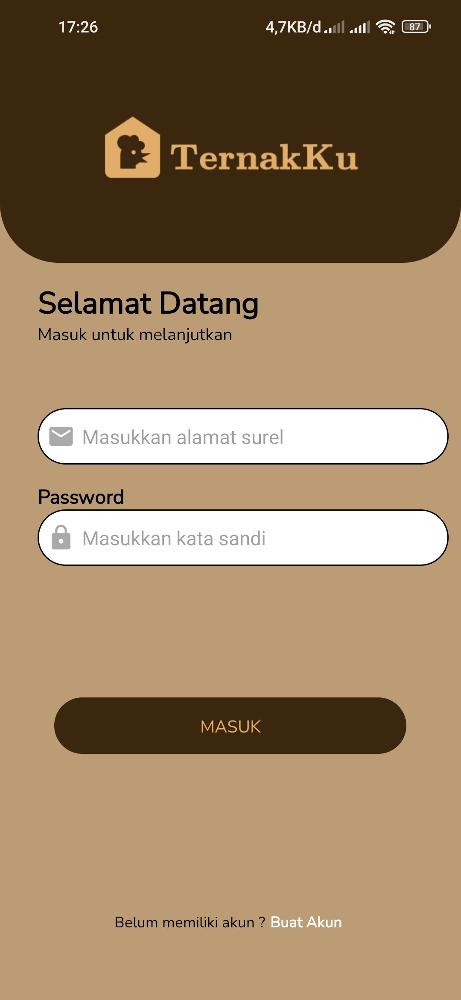
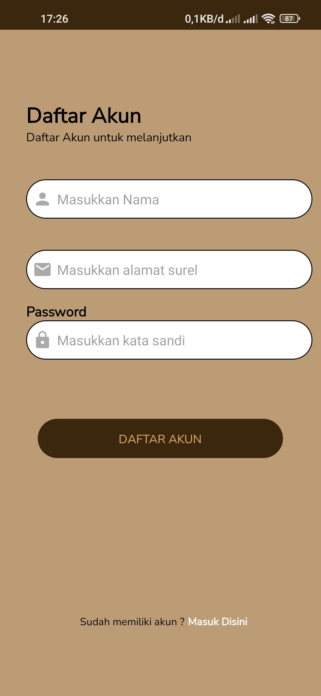
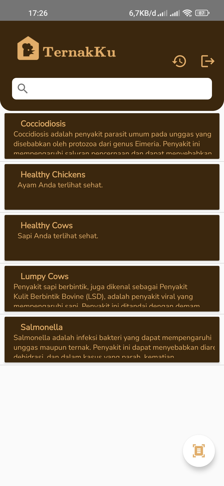
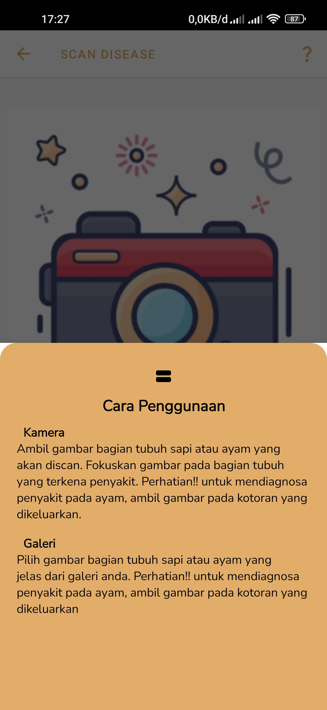
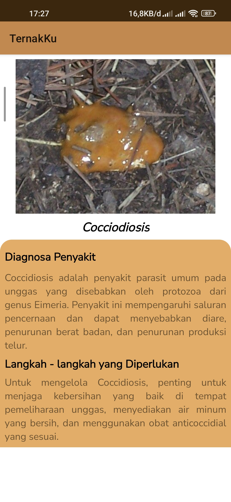
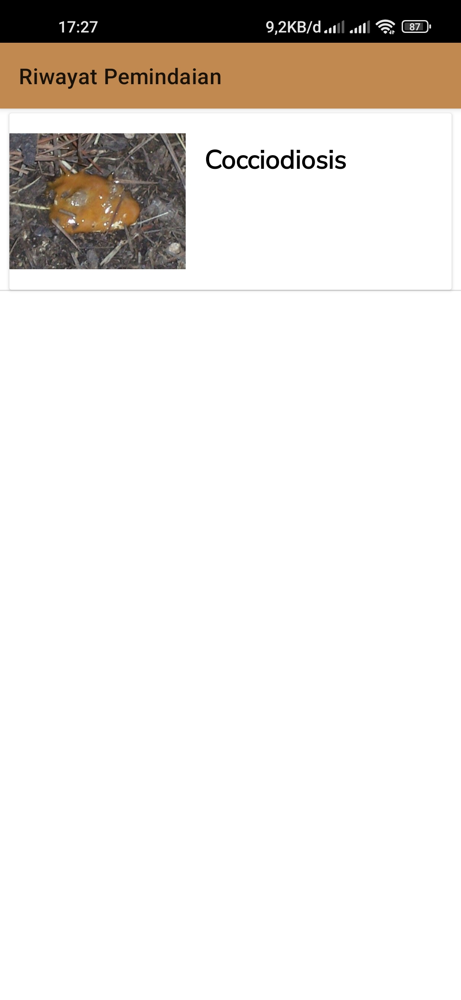

# TernakKu-Bangkit-2023-Product-Capstone-Team : C23-PS408
.
.

<h1 align="center">
  </img>
 
TernakKu
</h1>
  

  This is a capstone project on  <a href="https://grow.google/intl/id_id/bangkit/"><strong>Bangkit Academy led by Google, Tokopedia, Gojek, & Traveloka</strong></a>
   Program.
     
    <a href="https://github.com/TernakKu/TernakKu-Bangkit-2023-Product-Capstone"><strong>Explore this project »</strong></a>
     
  

## Project Background
Information about diseases for farmers on their livestock are needed, especially for farmers who live far from town or in a rural area which are far away from vets and that would be a challenge for them if their livestock get diseases and they don’t know or are not aware of diseases due to lack of knowledge or limitations on technology they use as a result, the health of the animals is also a concern, and also leading to lower productivity and profitability for the farmers. 

Our goal in building this application is to assist farmers where they have access to a user-friendly application that can help them identify diseases. The app will improve the health of the animals and ultimately increase the farmers' productivity and profitability.

## Capstone Project Team Member

|            Member           | Student ID |        Path        |                    Role                    |                                                       Contacts                                                      |
| :-------------------------: | :--------: | :----------------: | :----------------------------------------: | :-----------------------------------------------------------------------------------------------------------------: |
|   Cendana Harry Kristianto  | M042DKX3752 |  Machine Learning  |Machine Learning Engineer |      [Github](https://github.com/chakristianto)  |
| Diaz Ramadhan| M181DKX4140 |  Machine Learning  |          Machine Learning Engineer         |   [Github](https://github.com/DiazJavuRmdhn)  |
| Danang Dasa Ajunmas Rapita| A042DSX3384 | Mobile Development |          Android Mobile Developer          |    [Github](https://github.com/danangdasa)  |
| Muhammad Rifgi Alghifari | A042DKX4942 | Mobile Development |          Android Mobile Developer          |    [Github](https://github.com/Rifgi18)   |
|     Wahyu Wardana     | C135DSX2210 |   Cloud Computing  |               Cloud Engineer              |         [Github](https://github.com/Wahyuwardana2)  |
| M. Khawaril Putra | C353DSX1960 |   Cloud Computing  |          Cloud Engineer        |  [Github](https://github.com/mkput) |

## Screenshot 

  
  
  
  

  
  
  
  

## Installation
* First you need to Instalation the IDE such as [Android Studio](https://developer.android.com/studio) or [Visual Studio Code](https://code.visualstudio.com/)
* In the terminal, navigate to the location in which you would like to store the repo. You can do so by typing the following command:
  `$ cd <Directory>` -> Example : `$ cd "Documents/"`
* Now clone the repo URL ternakku in the location folder that you pick the command should be this:
  `$ git clone https://github.com/TernakKu/TernakKu-Bangkit-2023-Product-Capstone.git`
* Give the process a few moments to complete. If the process sucess you can open it in the Android Studio or VSCode and run it in your emulator

# License
Distributed under the MIT License. See `LICENSE` for more information.

 LifeAtBangkit   C23-PS408 Teams 

